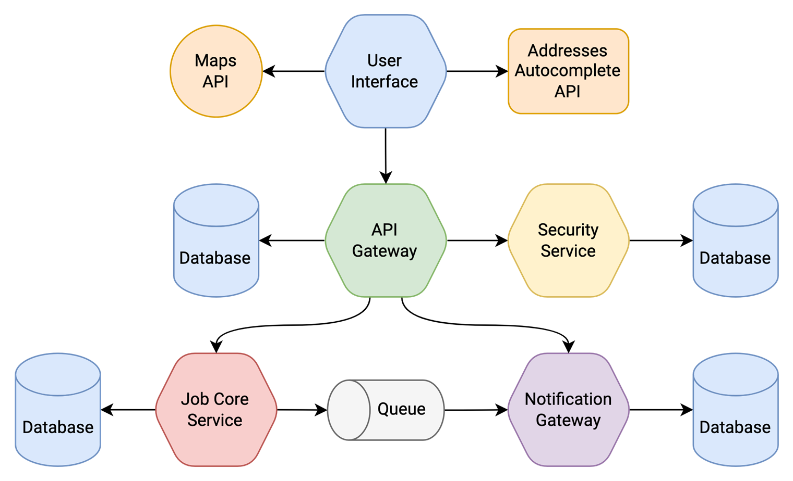
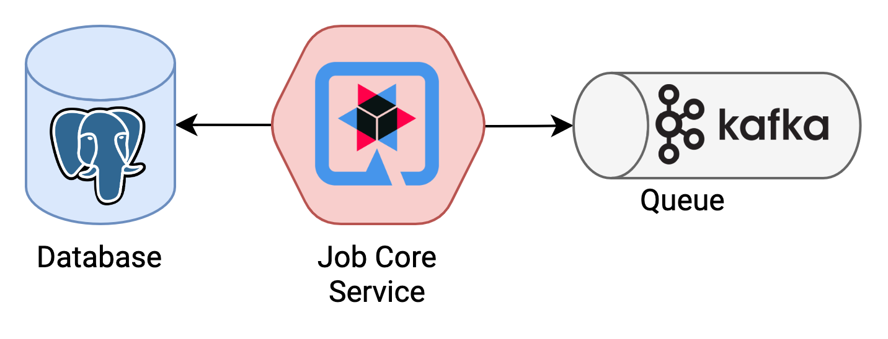

# Job-core-service

## Описание
    Сервис, отвечающий за управление сущностями с помощью rest api, и отправку сообщений об уведомлениях в очередь
    сообщений kafka.

## Диаграмма общей архитектуры приложения

## Диаграмма архитектуры сервиса

[Md файл с диаграммами компонентов и последовательностей модуля уведомлений в job-core-service](./docs/Notification module in Job-Core-Service.md)