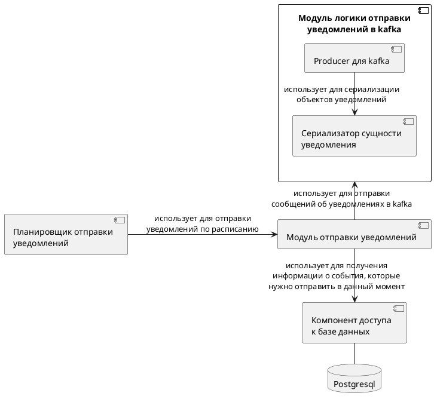
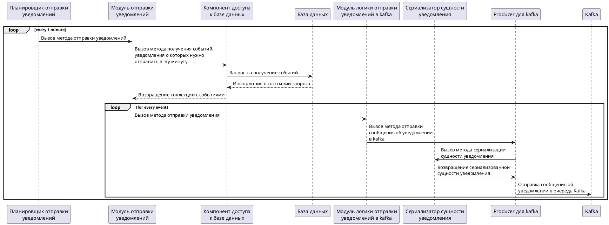

# Notification module in Job-Core-Service component diagram #

```plantuml
@startuml

left to right direction

[Компонент доступа\nк базе данных] as DbAccess
[Модуль отправки уведомлений] as Sender
[Планировщик отправки\nуведомлений] as Scheduler
component "Модуль логики отправки\nуведомлений в kafka" as SenderLogic {
    [Сериализатор сущности\nуведомления] as Serializer
    [Producer для kafka] as Producer
}
database "Postgresql" as DB

Sender -> DbAccess: использует для получения\nинформации о события, которые\nнужно отправить в данный момент
Sender -> SenderLogic: использует для отправки\nсообщений об уведомлениях в kafka
Serializer <- Producer: использует для сериализации\nобъектов уведомлений
Scheduler --> Sender: использует для отправки\nуведомлений по расписанию
DbAccess - DB

@enduml
```

# Sequence diagram получения уведомления, его подготовки и отправки в определенное время в kafka в Job-Core-Service  #

```plantuml
@startuml

participant "Планировщик отправки\nуведомлений" as Scheduler
participant "Модуль отправки\nуведомлений" as Sender
participant "Компонент доступа\nк базе данных" as DbAccess
participant "База данных" as DB
participant "Модуль логики отправки\nуведомлений в kafka" as SenderLogic
participant "Сериализатор сущности\nуведомления" as Serializer
participant "Producer для kafka" as Producer

loop every 1 minute
    Scheduler -> Sender: Вызов метода отправки уведомлений
    Sender -> DbAccess: Вызов метода получения событий,\nуведомления о которых нужно\nотправить в эту минуту
    DbAccess -> DB: Запрос на получение событий
    DbAccess <-- DB: Информация о состоянии запроса
    Sender <-- DbAccess: Возвращение коллекции с событиями
    loop for every event
        Sender -> SenderLogic: Вызов метода отправки уведомления
        SenderLogic -> Producer: Вызов метода отправки\nсообщения об уведомлении\nв kafka
        Producer -> Serializer: Вызов метода сериализации\nсущности уведомления
        Producer <-- Serializer: Возвращение сериализованной\nсущности уведомления
        Producer -> Kafka: Отправка сообщения об\nуведомлении в очередь Kafka
    end
end

@enduml
```
